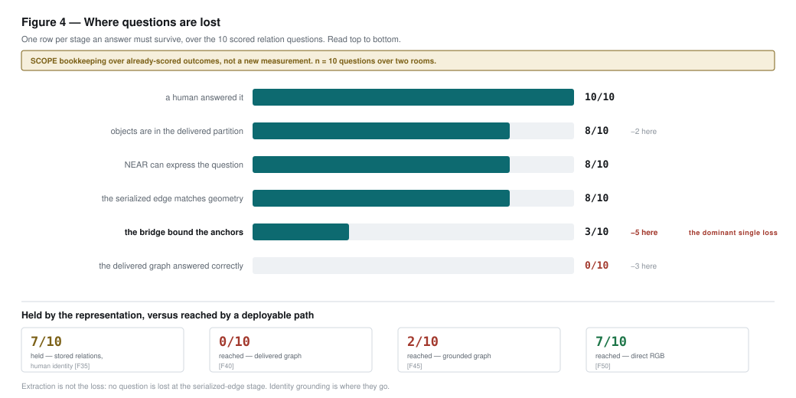

# Held but Unreachable: A Scoped Decomposition of Where Spatial Information Is Gained, Retained and Lost

*Submission-ready synthesis. **Numeric authority: commit `78d5d80`**, via
`docs/project_results_registry.csv` (271 rows). Every quantitative *result* claim cites a
`result_id`; the mapping is audited in Appendix A and machine-checked in
`docs/paper_claim_audit.csv`. Protocol facts and repository counts are sourced to
their documents instead. Figures are regenerated from the registry by
`tools/paper_figures.py` and are byte-reproducible. Section 2's citations were each
gathered and then independently fact-checked by a second reader; the bibliography is
`docs/paper_references.bib`, which records the verification verdict for every entry.*

---

## Abstract

We report a scoped decomposition of spatial question answering over real handheld room
captures. Rather than a single accuracy number, we measure each pipeline stage against a
scope discipline separating what a system *could* express from what a deployable path
can *reach*, and find the two far apart.

Replacing only the labeler's input images — real capture crops instead of point-splat
renders, with weights, vocabulary, threshold, evaluator, delivered partitions and
matching all fixed — raises matched-instance top-1 from 1/21 to 12/21 `[C01, C02]` and
top-3 from 4/21 to 18/21 `[C03, C04]` across three scenes with no tuning between them.
Paired per instance the change is one-directional `[G01, G02]`. This is a component
evaluation on an oracle-selected denominator, not end-to-end performance.

On a relation benchmark over two rooms, the *same stored relations* answer 7 of 10
scored items when identity is supplied by a human `[F35]`, 0 of 10 from learned labels
`[F40]`, and 2 of 10 through an oracle-free grounding bridge `[F45]` — a paired
substitution sizing a bound, not a system improvement `[G06]`. Relation serialization adds no measurable loss relative to recomputation under the same AABB convention: a replay reading only serialized edges agrees with recomputed geometry
on 12 of 12 items `[F63]`. The information is present in the
store and was not reached by any of the three identity paths we instantiated; the
binding stage is identity.

On a previously untouched room, direct multiview RGB answers 5 of 10 with **zero wrong
answers** `[F76, F77]`, declines all three non-co-visible items `[F79]`, and fails both
predeclared gates `[F82, F83]`.

The contribution is the decomposition and its scope discipline, with negative results
committed as first-class artifacts — not a solved room-understanding system.

---

## 1. Introduction

Spatial question answering over captured 3D scenes fails for several reasons at
once: reconstruction error, instance segmentation, naming, relation extraction,
and question grounding. A single end-to-end score cannot say which. Worse, the
failure modes are unusually good at imitating one another. A representation that
cannot *express* a relation looks, from the outside, exactly like one that
expresses it and gets it wrong. A system handed correct object identities looks
like a system that found them. An abstention looks like an error.

This paper's method is to remove those confusions by construction. Each experiment
changes exactly one upstream variable, and every measurement carries a **scope**
that states what it is entitled to claim (§3). Three results anchor the paper:

1. **Naming is improvable and the gain is large** (§4.1) — but the measurement is a
   component evaluation, not deployable performance.
2. **Relational information is present in the representation and unreachable
   through the deployed identity stage** (§4.2) — the paper's central finding.
3. **The obvious alternative does not close the gap** (§4.3) — direct multiview RGB
   transfers its *calibration* to an unseen room but not its *reach*.

## 2. Related work

**Open-vocabulary 3D representations and scene graphs.** Dense open-vocabulary 3D
understanding fuses 2D vision-language features into a 3D map
[jatavallabhula2023conceptfusion, peng2023openscene]; instance-level work makes objects
explicit [takmaz2023openmask3d, nguyen2024open3dis, lu2023ovir3d], with LERF
[kerr2023lerf] the radiance-field analogue. Scene graphs add relational structure
[armeni20193dscenegraph, wu2021scenegraphfusion, hughes2022hydra, looper20233dvsg,
koch2024open3dsg, werby2024hovsg, zhu2026ogscene3d]. ConceptGraphs [gu2024conceptgraphs]
is the closest prior representation. What this line *reports* is the point of contact:
per-point mIoU, instance AP, retrieval mAP, or construction fidelity — never an
end-to-end answer rate, and nearly always against human-annotated instances, an
oracle-supplied denominator. ConceptGraphs reports node precision and edge precision as
two *separate* human-judged numbers, with edges scoring higher: our result already
latent in the closest prior system, missing only the number that composes them.

**Answering questions from stored 3D scenes.** Embodied QA [das2018embodiedqa,
gordon2018iqa] established the task; ScanQA [azuma2022scanqa], SQA3D [ma2023sqa3d] and
OpenEQA [majumdar2024openeqa] made it a benchmark; systems answer over 3D scenes
[hong20233dllm, huang2024leo, huang2024chatscene, zhu2025llava3d]. The convention is one
accuracy per system, conflating perception, identity grounding, relation extraction and
answer generation. Several systems answer *from a persistent graph*, and they bound what
we may claim: GraphEQA [saxena2025grapheqa] feeds a real-time scene graph plus retrieved
images to a VLM planner and ablates graph-only against images-only; BBQ [linok2025bbq]
serializes stored metric-semantic edges into an LLM prompt; SG-Nav [yin2024sgnav] is the
reference design for that serialization and adds re-perception precisely because wrong
node identity poisons downstream use; VL-KnG [almdfaa2026vlkng] makes identity
association an explicit module; 3D-Mem [yang2025threedmem] argues the opposite design,
keeping retrieved images *as* the memory. We therefore claim no novelty for combining a
graph with retrieved images, for ablating graph against images, or for observing that
detector quality bounds graph-mediated QA — GraphEQA states that in its own limitations.

**What we concede, and what remains.** Three works break the single-number convention
and we position as their continuation: Beacon3D [huang2025beacon3d] decouples grounding
from answering, MV-ScanQA [mo2025mvscanqa] shows few existing 3D QA questions need more
than one view, and Jin et al. [jin2025revisiting3d] find 2D VLMs on rendered views match
3D LLMs. We concede both constructs rather than compete: [huang2025beacon3d] established
grounding-versus-answering attribution and [mo2025mvscanqa] formalised cross-view
necessity. What separates this work is narrower. Prior stage-wise analyses compare the
*quality* of stored representations [gu2024conceptgraphs], split *inference-time* stages
of a model over an already-annotated scene [huang2025beacon3d], or report an oracle bound
produced by a *different system* [azuma2022scanqa, takmaz2023openmask3d]. None places an
oracle-fed and a pipeline-labelled number side by side on the same questions over the
same store. GraphEQA illustrates why that matters: its benchmark results use dataset
ground-truth segmentation masks, and its only detector-fed evaluation is a handful of
real-world trials with no aggregate — so the gap between what its representation could
support and what a deployable one delivers is not recoverable from the paper.

**Direct multimodal baselines.** VLMs read off RGB are competitive with dedicated 3D
systems at room scale [qi2026gpt4scene, chen2024spatialvlm, cheng2024spatialrgpt], and
benchmarks map the weaknesses [fu2024blink, yang2025thinkinginspace, yeh2026allangles,
yang2026mmsibench, kamath2023whatsup, ma2025srbench, xie2026spatialqa]. These carry no
persistent 3D state, so nothing in them can *hold* information. We reproduce the
phenomenon rather than dispute it — direct RGB is the strongest deployable path we
measured — but note that several strong 2D baselines sidestep identity grounding rather
than solving it: SpatialRGPT consumes supplied region proposals, GPT4Scene supplies
object identifiers on a bird's-eye image. Those are identity oracles in our vocabulary.

**Diagnosis by substitution, and abstention.** Our method is the oracle-substitution
tradition [hoiem2012diagnosing, bolya2020tide, hosang2016proposals, zellers2018motifs],
with Min et al. [min2019compositional] the cautionary case. We borrow the primitive —
substitute ground truth at one point, read the downstream delta — and add that the
substitution's scope must travel *with* the number rather than living in a footnote.
Every precedent stays inside one model or one homogeneous output type. Our predeclaration
practice draws on benchmark-integrity work [musgrave2020reality, dacrema2019progress,
lipton2019troubling, bouthillier2021variance, recht2019imagenet, bertinetto2021prereg].
Selective prediction supplies the vocabulary our transfer result needs [chow1970reject,
elyaniv2010foundations, geifman2017selective, geifman2019selectivenet,
hendrickx2024reject], as does calibration [guo2017calibration, kadavath2022know] and the
QA side [rajpurkar2018squad2, kamath2020selectiveqa, whitehead2022reliablevqa,
ren2024exploreuntilconfident]. What none addresses is *where inside a pipeline* the
abstention-worthy uncertainty originates: selective classification attaches a selection
function to a monolithic predictor's output, and QA-side work locates unanswerability in
the input. Neither expresses a system that should have been able to answer because its
own store held the fact, and did not reach it.

## 3. Method: an evaluation ladder with explicit scope

### 3.1 The scope discipline

Every measurement in this work carries one of seven scopes, and the distinctions are
enforced in code rather than promised in prose:

| scope | what it may claim |
|---|---|
| `deployable` | end-to-end performance of a shippable path; no oracle, no human key in the answer path, and the denominator is not oracle-selected |
| `oracle_free_component_eval` | the prediction path is oracle-free, but the **denominator is oracle-selected**; a component result only |
| `delivered` | the delivered pipeline's own output, scored against a key |
| `proposal_ceiling` | an oracle-evaluated upper bound on proposals |
| `identity_oracle` | consumes human-supplied identity; a **bound**, never system performance |
| `definition-change` | the benchmark definition moved, not the model |
| `bug-diagnostic` | a correctness fix; never a model before/after |

Answer production and grading are separate functions: no layer that produces an
answer can read an expected value, and a syntax-tree test fails the build if a
deployable answer function so much as binds a key-shaped name.

### 3.2 The ladder

Figure 1 shows the five layers used for relation QA. Each holds the same geometry,
the same serialized relations and the same questions fixed, and changes only where
object identity comes from. Two of the five consume human-supplied identity and are
therefore bounds; they are hatched in every figure and carry a NOT DEPLOYABLE badge
wherever they appear.

### 3.3 Predeclaration

Gates, stopping rules and interpretation limits are written and committed before the
corresponding scores exist. Twice this caught a *structurally unreachable* outcome before
measurement: a predeclared clause that cannot fire is a broken instrument, not a null
result, and only a check in advance reveals it. In the first relation experiment the
routing structure made the accuracy clause unreachable, and it duly came in at exactly
`0.0000` `[F25]` with the proceed decision `false` `[F27]`.

Blinded responses are generated in an isolated context with **no access to the key** and
hash-pinned before scoring. The protection is isolation plus the hash pin, not
version-history ordering: for the transfer run the key commit precedes the response
commit, so commit order does not prove the response predates the key. The commit
chronology, the full amendment history of the transfer protocol, and the scope table in
full are in the supplement.

## 4. Results

### 4.1 Real capture crops as the labeler input (component result)

The label stage classified each delivered instance from three isolated point-splat
renders. Replacing those images with real capture RGB crops — and changing nothing
else — produces the largest improvement measured on any oracle-free prediction path in
this project.

| scene | splat top-1 | rgb_tight top-1 | splat top-3 | rgb_tight top-3 |
|---|---|---|---|---|
| 41069021 | 0/7 `[C05]` | 5/7 `[C07]` | 0/7 `[C06]` | 7/7 `[C08]` |
| 41069025 | 1/9 `[C09]` | 5/9 `[C11]` | 4/9 `[C10]` | 8/9 `[C12]` |
| 41069042 | 0/5 `[C13]` | 2/5 `[C15]` | 0/5 `[C14]` | 3/5 `[C16]` |
| **pooled** | **1/21** `[C01]` | **12/21** `[C02]` | **4/21** `[C03]` | **18/21** `[C04]` |

**Paired, the effect is stronger than the marginals suggest.** Both arms were scored
on the same matched instances, so the comparison is paired by construction. At top-1,
RGB fixes 12 instances and regresses 1 — 13 discordant pairs, exact McNemar
p = 0.00341797 `[G01]`. At top-3 it fixes 14 and regresses none, p = 0.00012207
`[G02]`. The test is the two-sided exact binomial on discordant pairs, not the
chi-square approximation, which these counts are far too small for. **The limitation
is clustering:** the 21 instances sit within only three scenes and the test treats
them as independent, which they are not — instances in one room share a capture, a
lighting condition and a reconstruction. This is an instance-level statement and not
a scene-level or dataset-level one.

Held fixed: OpenCLIP `ViT-B-32-quickgelu`/`openai` weights, the class vocabulary,
`top_k=3`, `min_top1_score=0.28`, the evaluator, the delivered Mask3D partitions,
and greedy IoU ≥ 0.50 matching. Only the images changed, and no constant was tuned
between scenes.

**A control constrains the interpretation.** A wide crop of a doorway reads as a
kitchen, so a naive RGB win could have been the model recognising *rooms* rather
than *objects*. A third arm with wider context and the target dimmed, run on the
development scene only (7 of the 21 pooled instances), scores **below** the tight arm
at both ranks — 3/7 `[C17]` and 5/7 `[C18]` against that scene's 5/7 `[C07]` and 7/7
`[C08]`. More context measurably hurts, which **supports** the interpretation that the
gain comes from object texture rather than room gist. It does not prove it.

One observation is worth recording for what it suggests rather than what it shows: six
of the 21 matched instances kept the canonical class in the top three and lost it to
hard top-1 commitment `[G07]`. We make no claim that retaining those hypotheses would
improve question answering — that has not been tested.

**Scope.** This is `oracle_free_component_eval`. The prediction path consumes no
oracle and no human key, but the denominator of 21 is instances the evaluator had
already matched to an annotation box. The number is therefore conditional on
detection having succeeded and says nothing about detection itself: on the same
scenes the delivered pipeline recovered 7/18 `[C29]`, 9/20 `[C30]` and 5/6 `[C31]`
annotated entities — the per-scene recoveries that the matched
denominator is drawn from. **This result must not be reported as end-to-end or deployable
performance.**

### 4.2 Held but unreachable

The central experiment asks twelve questions about `NEAR` — the one relation the
delivered graph actually contains — across two rooms, with ten items scored after
the owner marked two ambiguous `[F65]`. Five layers answer the same questions over the same
stored relations, differing only in where object identity comes from.

| layer | identity from | correct | coverage | scope |
|---|---|---|---|---|
| geometry ceiling | human | 7/10 `[F28]` | 0.800 `[F31]` | `identity_oracle` |
| stored-edge replay | human | 7/10 `[F35]` | 0.80 `[F38]` | `identity_oracle` |
| delivered graph | learned labels | 0/10 `[F40]` | 0.00 `[F43]` | `delivered` |
| grounded graph | grounding bridge | 2/10 `[F45]` | 0.20 `[F48]` | `delivered` |
| direct multiview RGB | the images | 7/10 `[F50]` | 0.90 `[F53]` | `deployable` |

The direct-RGB row carries a cost the correct-count hides: on these development
rooms it was **wrong on 2 of 10** `[F51]`. That is the baseline against which §4.3's
unseen-room behaviour must be read.

Three findings follow, and their order matters.

**Serialization adds no measurable loss.** The stored-edge replay reads
*only* edges the extractor serialized and recomputes no geometry. It agrees with the
recomputed geometry ceiling on all 12 authored items `[F63]` — every answer, every
abstention, and the single shared error. Nothing measurable is lost between the
delivered boxes and the graph on disk, which eliminates a whole class of explanation.
The scope is `identity_oracle` and the limits are real: **both compared arms consume
human-supplied identity**, the comparison covers the single `NEAR` relation, and the
denominator is the 12 authored items rather than the 10 scored ones. It clears
extraction on this slice; it demonstrates no deployable capability.

**Identity is what binds.** Seven of the ten scored items are *ceiling-correct,
delivered-unanswered* `[F64]`. The delivered pipeline could not address the
questions at all: the delivered graph scored 0/10 `[F40]`, and delivered-graph-unique
correct answers were 0 against a predeclared bar of 2 `[F60]`. That the label stage
resolves only a single anchor across both scenes is recorded as a pre-registration in
`[F40]`'s provenance, not as a measured row, and we do not quote a denominator for it
here.

**An oracle-free bridge does not close it.** A grounding bridge encoding anchor
phrases and real capture crops with the same pinned weights, admitting a match only
on cross-view agreement and with no confidence threshold anywhere, moved the
delivered graph arm from 0/10 `[F40]` to 2/10 `[F45]` — and failed all three predeclared
gates: anchor precision 0.583 against ≥ 0.80 `[F67]`, coverage 0.467 against ≥ 0.60
`[F68]`, and graph-unique wins 0 against ≥ 2 `[F69]`. Of the 17 question anchors, 15
were human-resolvable, the bridge admitted 12, and 7 of those admissions were correct
`[F70]`.

**A ledger makes the transitions explicit.** Rather than argue about where the
capability goes, we record for each question whether it survived each stage it must
pass: a human answered it, its objects are in the delivered partition, `NEAR` can
express it, the serialized edge reproduces the geometry, and the bridge bound its
anchors. The full table is `docs/paper_reachability_ledger.csv`.

Of the 10 scored questions, 8 survive object delivery `[G03]` and all 8 survive both
relation expressibility and the serialized-edge stage — **no question is lost to
relation extraction** `[G05]`. Three survive anchor grounding `[G04]`. The single
largest loss, five of ten, is at identity grounding, and it is larger than every other
transition combined. The substitution is paired: 7 items are answered under
human-supplied identity that the delivered graph does not answer, none the other way,
exact McNemar p = 0.015625 `[G06]`. Because one side of that comparison consumes human
identity, it sizes a bound — it says the arms differ, not that anything deployable
achieves 7/10.

One failure is diagnostic of the mechanism. The bridge admitted a UID for an object
the owner had marked absent from the delivered partition, with maximum cross-view
agreement `[F75]`. Cross-view agreement measures *consistency*, not *existence*.

### 4.3 Transfer to an untouched room

Direct multiview RGB at 7/10 `[F50]` was the strongest deployable arm, but both
rooms had been examined for months. We froze the protocol — question-generation
procedure, view selection, prompt, schema, scoring and two gates — and committed it
**before** downloading a previously untouched capture.

Question generation reduces direct author selection: three agents independently
enumerated objects from the same frames with no access to each other or to any
question; an object became an anchor on two-of-three agreement; anchors were ordered
mechanically and a fixed template allocated slots; relational slots were restricted to
anchors all three passes agreed there was exactly one of.

**The generator was amended twice, and we state it plainly.** Run 1's eight questions
came back with four marked ambiguous, leaving n = 4 — a size at which the coverage gate
degenerates into an anti-abstention gate. Run 1 was voided and the generator amended
twice, for scope wording and anchor ordering, then to restrict relational slots to
unique-referent anchors. What protects the result is narrower than "we froze it first":
**the blinded model never ran in run 1**, so nothing scored was selected on an outcome,
and both amendments addressed defects visible in the questions alone. Run 2 was authored
and scored once at n = 10 `[F84]`. A reader who prefers the weaker reading — that a
generator was iterated twice on this scene before producing a scorable set — is entitled
to it, and that is itself a finding about fixed-procedure generation. The full amendment
history, the void-run key and the self-imposed limit on further amendment are in the
supplement.

| metric | value | |
|---|---|---|
| correct | 5/10 `[F76]` | |
| **wrong** | **0/10** `[F77]` | never once confidently wrong |
| unanswered | 5/10 `[F78]` | |
| accuracy when answered | 1.000 `[F85]` | |
| false-confident rate | 0 `[F86]` | |
| presence items | 3/3 `[F80]` | |
| comparative items | 2/4 `[F81]` | |
| **cross-view items** | **0/3** `[F79]` | all declined |
| exact accuracy (gate ≥ 0.60) | 0.50 `[F82]` | **fail** |
| answer coverage (gate ≥ 0.80) | 0.50 `[F83]` | **fail** |

Both gates failed, so **no transfer claim is made** `[F88]`.

The shape of the failure is the result. It is not an accuracy failure: every answer
given was correct `[F85]` and none was wrong `[F77]`. It is entirely coverage — and
because exact accuracy counts an abstention as a non-correct item, a perfectly
calibrated abstainer fails both gates on one behaviour. The model declined precisely
the category that motivates the work.

We resist the phrase "calibration transferred". On the development rooms the same
arm was **wrong on 2 of 10** `[F51]` at 0.90 coverage `[F53]`, and its two-view
sufficiency gate never fired on any of the 7 thin-evidence items there `[F66]`; on the unseen room it declined 4 of 6 thin-evidence items and
was right on both it answered `[F87]`. That is a *change* in abstention behaviour
between rooms, measured once on each, not a property carried across. The defensible
statement is narrower: on this room the arm abstained rather than guessed, and
`[F86]`'s zero false-confident rate is over the five items it answered.

This also suggests a re-reading of the earlier 7/10: those cross-view items were
likely answerable from co-visible evidence. With three genuinely non-co-visible pairs produced by a
generator that could not select for answerability, direct RGB produced nothing.

## 5. Limitations

**Scale.** Four ARKitScenes rooms (three examined, one untouched until §4.3) and four
Replica scenes; six, twelve and ten questions per experiment; one blinded response each;
one human reviewer, who is the project owner and is not blind to the hypothesis. The key
is itself a measurement with error: one earlier key scored a cardinality item against
all four arms on a counting convention it never stated `[F14]`, our sources still
disagree on the true count, and we report the disagreement rather than settle it.

**Scope bounds.** §4.1's denominator is oracle-selected `[C02]`, conditional on
detection succeeding and silent about detection. §4.2's 7/10 rows `[F28, F35]` consume
human-supplied identity and bound what the representation could express. The
serialization check `[F63, G05]` applies the same 1.0 m AABB convention on both sides,
so it catches a plumbing error but cannot detect a wrong convention. §4.3 is a single
unseen capture licensing no statement about handheld capture in general, and both gates
failed.

**An exploratory result is excluded from the claims.** A human-keyed support experiment
on one ARKit scene recovered 1 of 3 owner-confirmed positives `[E27]` at precision 1.0
over a single admitted candidate `[E28]` and recall 0.3333333333333333 `[E29]`. Two of
its three keyed positives appear only in the final owner-corrected key with no
independent returned-form record, so the recall denominator rests on pairs captured
once. It is marked exploratory in the registry and is deliberately not a headline.

**Reproducibility.** 283 registry rows, each carrying a scope; a sanitized pack of 23
numeric reports with original paths, sha256 and producing commits accompanies the paper,
because most run artifacts live in an ignored tree. Twenty-eight rows cite an untracked
primary source and cannot be reproduced from the repository alone; a further 52
quantities could not be verified against any committed artifact and are enumerated in
the census rather than entered in the registry. None is load-bearing for any claim in
§6.

## 6. Conclusion

A representation can hold correct information that the deployable query paths we
instantiated do not reach. We measured that gap directly: the same stored relations
answer 7 of 10 with human-supplied identity and 0 of 10 with the identity the system
actually produces `[F35, F40]`, while the serialized edges reproduce recomputed geometry
on all 12 tested items `[F63]`. Identity grounding is the dominant measured loss on this
`NEAR` slice; relation serialization adds no measurable loss on those items. We claim
nothing broader. Nothing here clears relation *extraction*: only that serialization
added no measurable loss relative to recomputation under the same convention, on twelve
items, over human-resolved delivered objects.

What the decomposition establishes, in order:

1. **Real RGB substantially improves the label stage on oracle-matched instances**
   `[C01, C02, C03, C04]` — a component evaluation on an oracle-selected denominator,
   **not end-to-end or deployable performance** — with a development-scene control that
   supports, but does not prove, the object-texture reading `[C17, C18]`.
2. **Stored 3D relations contain useful answers for human-resolved objects, and current
   deployable grounding reaches few of them** — 7/10 `[F35]` against 0/10 `[F40]` and
   2/10 `[F45]`, with serialization consistent on this slice at 12/12 `[F63]`.
3. **Direct RGB is the strongest current answer path for visible evidence** — 7/10 at
   0.90 coverage `[F50, F53]`, though wrong on 2 of 10 on those rooms `[F51]`.
4. **Neither deployed path yet handles genuinely non-co-visible questions reliably** —
   the graph arm cannot reach them `[F40]`, and RGB declines them on an unseen room
   `[F79]`.

**The contribution is an evaluation-method one, and narrower than "decomposition".**
Stage-wise attribution in 3D-VL is prior work [huang2025beacon3d], as is cross-view
necessity [mo2025mvscanqa]. What we add is a conjunction that appears unoccupied: the
relation store is **checked for serialization consistency** against geometry recomputed
under the same AABB convention `[F63, G05]` before anything is claimed about it — a
bounded check, since a shared convention catches a plumbing error but cannot detect a
wrong convention — and **identity is the only varied variable**, the same serialized
edges queried under three identity sources `[F35, F40, F45, G06]`, where prior oracle
contrasts swap the whole input modality and model. A third element, **scoring a decline
as an outcome distinct from a wrong answer**, is a protocol proposal rather than a
validated contribution: "5 correct, 0 wrong, 3 declined" `[F76, F77, F79]` is not
expressible in the benchmarks above, but proposals are validated by adoption, and ten
authored items cannot demonstrate that.

We do **not** claim that representations in general hold unreachable information, that
*no* deployable path could reach it, or any ordering among 7, 2 and 0. The defensible
statement is bounded to this pipeline, these two rooms, and the three identity paths we
instantiated. We report where spatial information is gained (naming, from real image
evidence), retained (serialized relations, with no measured loss on the tested items),
and lost (identity grounding, and instance delivery upstream of it). Every negative
result stands as measured; none was retuned or re-run.

---

## References

See `docs/paper_references.bib` (53 entries). Each entry was gathered by one reader
and independently checked for existence, authorship, venue and year by a second who
did not gather it; the verdict is recorded in each entry's `note` field. Two entries
were corrected after checking: `chen2024spatialvlm`'s author list was incomplete and
`jin2025revisiting3d` was attributed to arXiv rather than Findings of ACL 2025.

---

## Appendix A — Claim-to-registry audit

Machine-checked in `docs/paper_claim_audit.csv`, which is validated against
`docs/project_results_registry.csv` on every test run.

See that file for the complete row-level mapping: each paper claim, its section, the
`result_id`s it cites, the scope of each, and the sentence that may be written from it.

## StageReach3D additions (3DV revision, 2026-08-28)

The 3DV submission reframes the evaluation as StageReach3D, a scope-aware
stage-DAG evaluator. New derived results, registry-backed like everything
above:

- The evaluator's per-arm causal ladders reproduce the committed reachability
  statistics field-by-field — delivered 10->8->8->8->0, grounded
  10->8->8->8->3->2, stored-human 10->7, direct RGB 10->7 — as an equivalence
  between two independent derivations of the same packed report `[G08]`. The
  historical mixed ladder survives only as a legacy compatibility check.
- Over the 56 human-verified Replica items, the normalized outcome matrix is
  (answer,correct)=4, (answer,wrong)=20, (answer,abstain)=4,
  (empty,correct)=27, (empty,wrong)=1 `[G09]`, across per-scene populations of
  13/14/16/13 `[G10]`. Replica arms consume oracle geometry and identity:
  this demonstrates schema/outcome transfer of the evaluator and aggregate
  masking (a pooled 31/56 would mislead), not deployable performance.
- 24/24 controlled artifact-level injected faults were localized while the
  evaluator was masked to the injected class, with zero failures on clean
  artifacts `[G11]`. Synthetic fixture; validates attribution, not any
  system's performance.

- After the keys were frozen, a blinded independent human annotator
  answered all 12 relation questions from the committed packet frames:
  6 of 10 scored answers agree exactly after committed adjudication; 3 of
  the 4 disagreements are confidence-1 abstentions and the fourth is a
  confidence-3 set over-inclusion; the annotator marked neither originally
  excluded item ambiguous (one answered confidently, one "cannot
  determine") `[G12]`. Partial, not complete, key reproducibility. Keys
  were not altered in response; the evaluated system was not retuned.
