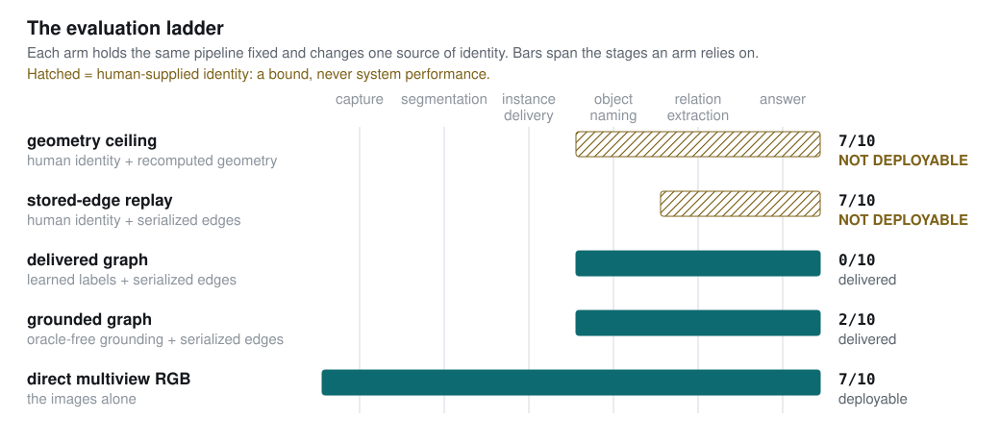
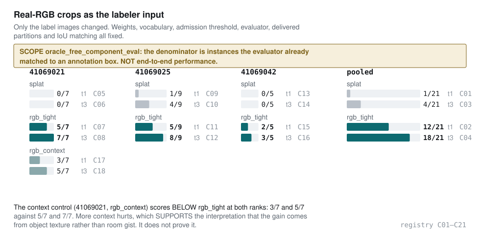
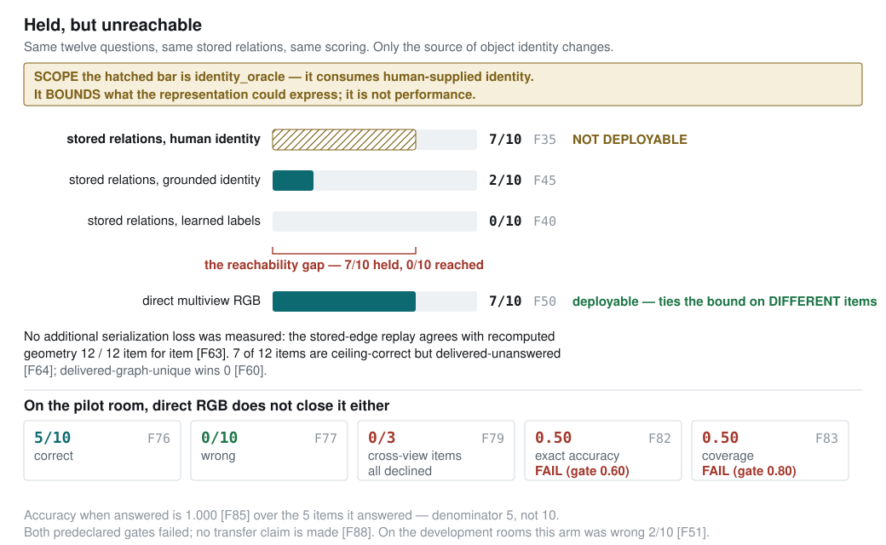

# Held but Unreachable: A Scoped Decomposition of Where Spatial Information Is Gained, Retained and Lost

*Submission-ready synthesis. **Numeric authority: commit `78d5d80`**, via
`docs/project_results_registry.csv` (271 rows). Every quantitative *result* claim cites a
`result_id`; the mapping is audited in Appendix A and machine-checked in
`docs/paper_claim_audit.csv`. Protocol facts and repository counts are sourced to
their documents instead. Figures are regenerated from the registry by
`tools/paper_figures.py` and are byte-reproducible. Section 2 (related work) is
deliberately left to the author — no citations are invented here.*

---

## Abstract

We report a scoped decomposition of spatial question answering over real handheld
room captures. Rather than a single accuracy number, we measure each stage of the
pipeline against a scope discipline that separates what a system *could* express
from what a deployable path can *reach*, and we find the two are far apart.

Replacing only the labeler's input images — real capture crops instead of
point-splat renders, with weights, vocabulary, admission threshold, evaluator,
delivered partitions and matching all held fixed — raises matched-instance
top-1 from 1/21 to 12/21 `[C01, C02]` and top-3 from 4/21 to 18/21 `[C03, C04]`
across three scenes with no tuning between them. This is a component evaluation on
an oracle-selected denominator, not end-to-end performance.

On a twelve-question relation benchmark over two rooms, the *same stored relations*
answer 7 of 10 scored items when object identity is supplied by a human
`[F35]`, 0 of 10 when identity comes from learned labels `[F40]`, and 2 of 10
through an oracle-free grounding bridge `[F45]`. Relation extraction is not the
loss: a replay reading only serialized edges agrees with recomputed geometry on
12 of 12 items `[F63]`. The information is present and unreachable, and the
binding stage is identity.

On a previously untouched room, direct multiview RGB answers 5 of 10 with **zero
wrong answers** `[F76, F77]` and perfect accuracy when it answers `[F85]`, but
declines all three non-co-visible items `[F79]` and fails both predeclared gates
`[F82, F83]`. Neither path yet answers genuinely cross-view spatial questions.

The contribution is the decomposition and its scope discipline — negative results committed as
first-class artifacts — not a solved room-understanding
system.

---

## 1. Introduction

Spatial question answering over captured 3D scenes fails for several reasons at
once: reconstruction error, instance segmentation, naming, relation extraction,
and question grounding. A single end-to-end score cannot say which. Worse, the
failure modes are unusually good at imitating one another. A representation that
cannot *express* a relation looks, from the outside, exactly like one that
expresses it and gets it wrong. A system handed correct object identities looks
like a system that found them. An abstention looks like an error.

This paper's method is to remove those confusions by construction. Each experiment
changes exactly one upstream variable, and every measurement carries a **scope**
that states what it is entitled to claim (§3). Three results anchor the paper:

1. **Naming is improvable and the gain is large** (§4.1) — but the measurement is a
   component evaluation, not deployable performance.
2. **Relational information is present in the representation and unreachable
   through the deployed identity stage** (§4.2) — the paper's central finding.
3. **The obvious alternative does not close the gap** (§4.3) — direct multiview RGB
   transfers its *calibration* to an unseen room but not its *reach*.

## 2. Related work

*Left to the author. No citations are invented in this draft.*

## 3. Method: an evaluation ladder with explicit scope

### 3.1 The scope discipline

Every measurement in this work carries one of seven scopes, and the distinctions are
enforced in code rather than promised in prose:

| scope | what it may claim |
|---|---|
| `deployable` | end-to-end performance of a shippable path; no oracle, no human key in the answer path, and the denominator is not oracle-selected |
| `oracle_free_component_eval` | the prediction path is oracle-free, but the **denominator is oracle-selected**; a component result only |
| `delivered` | the delivered pipeline's own output, scored against a key |
| `proposal_ceiling` | an oracle-evaluated upper bound on proposals |
| `identity_oracle` | consumes human-supplied identity; a **bound**, never system performance |
| `definition-change` | the benchmark definition moved, not the model |
| `bug-diagnostic` | a correctness fix; never a model before/after |

Answer production and grading are separate functions: no layer that produces an
answer can read an expected value, and a syntax-tree test fails the build if a
deployable answer function so much as binds a key-shaped name.

### 3.2 The ladder

Figure 1 shows the five layers used for relation QA. Each holds the same geometry,
the same serialized relations and the same questions fixed, and changes only where
object identity comes from. Two of the five consume human-supplied identity and are
therefore bounds; they are hatched in every figure and carry a NOT DEPLOYABLE badge
wherever they appear.

### 3.3 Predeclaration

Gates, stopping rules and interpretation limits are written and committed before
the corresponding scores exist. Twice this caught a *structurally unreachable*
outcome before measurement: a predeclared clause that cannot fire is not a null
result but a broken instrument, and it is only visible if checked in advance. In
the first relation experiment the routing structure made the accuracy clause
unreachable, and it duly came in at exactly `0.0000` `[F25]`, with the
proceed decision `false` `[F27]`.

Blinded model responses are generated in an isolated context with **no access to
the key** and are hash-pinned and committed before scoring.

We state the limit of that claim precisely, because an earlier draft overstated it.
For the transfer run the key was recorded at commit `45f8ec9` and the response
hash-pinned at `e193e6f` eight minutes later, so **commit order does not prove the
response predates the key**. What the record does establish is that the response was
produced in a context that never received the key, and that it was pinned by hash
before any score was computed. The protection is isolation and the hash pin, not
version-history ordering.

## 4. Results

### 4.1 Real capture crops as the labeler input (component result)

The label stage classified each delivered instance from three isolated point-splat
renders. Replacing those images with real capture RGB crops — and changing nothing
else — produces the largest improvement measured on any oracle-free prediction path in
this project.

| scene | splat top-1 | rgb_tight top-1 | splat top-3 | rgb_tight top-3 |
|---|---|---|---|---|
| 41069021 | 0/7 `[C05]` | 5/7 `[C07]` | 0/7 `[C06]` | 7/7 `[C08]` |
| 41069025 | 1/9 `[C09]` | 5/9 `[C11]` | 4/9 `[C10]` | 8/9 `[C12]` |
| 41069042 | 0/5 `[C13]` | 2/5 `[C15]` | 0/5 `[C14]` | 3/5 `[C16]` |
| **pooled** | **1/21** `[C01]` | **12/21** `[C02]` | **4/21** `[C03]` | **18/21** `[C04]` |

Held fixed: OpenCLIP `ViT-B-32-quickgelu`/`openai` weights, the class vocabulary,
`top_k=3`, `min_top1_score=0.28`, the evaluator, the delivered Mask3D partitions,
and greedy IoU ≥ 0.50 matching. Only the images changed, and no constant was tuned
between scenes.

**A control constrains the interpretation.** A wide crop of a doorway reads as a
kitchen, so a naive RGB win could have been the model recognising *rooms* rather
than *objects*. A third arm with wider context and the target dimmed, run on the
development scene only (7 of the 21 pooled instances), scores **below** the tight arm
at both ranks — 3/7 `[C17]` and 5/7 `[C18]` against that scene's 5/7 `[C07]` and 7/7
`[C08]`. More context measurably hurts, which **supports** the interpretation that the
gain comes from object texture rather than room gist. It does not prove it.

**Scope.** This is `oracle_free_component_eval`. The prediction path consumes no
oracle and no human key, but the denominator of 21 is instances the evaluator had
already matched to an annotation box. The number is therefore conditional on
detection having succeeded and says nothing about detection itself: on the same
scenes the delivered pipeline recovered 7/18 `[C29]`, 9/20 `[C30]` and 5/6 `[C31]`
annotated entities — the per-scene recoveries that the matched
denominator is drawn from. **This result must not be reported as end-to-end or deployable
performance.**

### 4.2 Held but unreachable

The central experiment asks twelve questions about `NEAR` — the one relation the
delivered graph actually contains — across two rooms, with ten items scored after
the owner marked two ambiguous `[F65]`. Five layers answer the same questions over the same
stored relations, differing only in where object identity comes from.

| layer | identity from | correct | coverage | scope |
|---|---|---|---|---|
| geometry ceiling | human | 7/10 `[F28]` | 0.800 `[F31]` | `identity_oracle` |
| stored-edge replay | human | 7/10 `[F35]` | 0.80 `[F38]` | `identity_oracle` |
| delivered graph | learned labels | 0/10 `[F40]` | 0.00 `[F43]` | `delivered` |
| grounded graph | grounding bridge | 2/10 `[F45]` | 0.20 `[F48]` | `delivered` |
| direct multiview RGB | the images | 7/10 `[F50]` | 0.90 `[F53]` | `deployable` |

The direct-RGB row carries a cost the correct-count hides: on these development
rooms it was **wrong on 2 of 10** `[F51]`. That is the baseline against which §4.3's
unseen-room behaviour must be read.

Three findings follow, and their order matters.

**Relation extraction is cleared on this slice.** The stored-edge replay reads
*only* edges the extractor serialized and recomputes no geometry. It agrees with the
recomputed geometry ceiling on all 12 authored items `[F63]` — every answer, every
abstention, and the single shared error. Nothing measurable is lost between the
delivered boxes and the graph on disk, which eliminates a whole class of explanation.
The scope is `identity_oracle` and the limits are real: **both compared arms consume
human-supplied identity**, the comparison covers the single `NEAR` relation, and the
denominator is the 12 authored items rather than the 10 scored ones. It clears
extraction on this slice; it demonstrates no deployable capability.

**Identity is what binds.** Seven of the ten scored items are *ceiling-correct,
delivered-unanswered* `[F64]`. The delivered pipeline could not address the
questions at all: the delivered graph scored 0/10 `[F40]`, and delivered-graph-unique
correct answers were 0 against a predeclared bar of 2 `[F60]`. That the label stage
resolves only a single anchor across both scenes is recorded as a pre-registration in
`[F40]`'s provenance, not as a measured row, and we do not quote a denominator for it
here.

**An oracle-free bridge does not close it.** A grounding bridge encoding anchor
phrases and real capture crops with the same pinned weights, admitting a match only
on cross-view agreement and with no confidence threshold anywhere, moved the
delivered graph arm from 0/10 `[F40]` to 2/10 `[F45]` — and failed all three predeclared
gates: anchor precision 0.583 against ≥ 0.80 `[F67]`, coverage 0.467 against ≥ 0.60
`[F68]`, and graph-unique wins 0 against ≥ 2 `[F69]`. Of the 17 question anchors, 15
were human-resolvable, the bridge admitted 12, and 7 of those admissions were correct
`[F70]`.

One failure is diagnostic of the mechanism. The bridge admitted a UID for an object
the owner had marked absent from the delivered partition, with maximum cross-view
agreement `[F75]`. Cross-view agreement measures *consistency*, not *existence*.

### 4.3 Transfer to an untouched room

Direct multiview RGB at 7/10 `[F50]` was the strongest deployable arm, but both
rooms had been examined for months. We froze the protocol — question-generation
procedure, view selection, prompt, schema, scoring and two gates — and committed it
**before** downloading a previously untouched capture.

Question generation reduces direct author selection: three agents independently
enumerated
objects from the same eighteen frames with no access to each other or to any
question; an object became an anchor only on two-of-three agreement; anchors were
then ordered mechanically and a fixed template allocation decided which filled which
slot. Relational slots were restricted to anchors all three passes agreed there was
exactly one of, so every singular definite description has a referent.

**The generator was amended twice, and we state it plainly.** The frozen template
allocated eight questions; the scored set is ten. Run 1 produced eight questions of
which the owner's returned key marked four ambiguous, leaving n = 4 with zero
cross-view items — at which size the coverage gate degenerates into an
anti-abstention gate. Run 1 was voided — protocol history, not a scored result:
commit `2d6d55a` and Amendment 1 of the transfer protocol — and the generator was
amended twice:
first for scope wording, anchor ordering and question count, then to restrict
relational slots to unique-referent anchors, after the ordering fix was found to
promote the *most numerous* anchors ("the cushion", where the passes counted four).
The two amendments are the source of the mechanical ordering and the unique-referent
rule described above; they are not the originally frozen text.

What protects the result is narrower than "we froze it first": **the blinded model
never ran in run 1** — no response was ever requested, so nothing scored was selected
on an outcome. Both amendments were applied before any blinded response existed, on
defects visible in the questions alone, and the protocol then bound itself against a
third ("no further structural amendment to this generator on this scene"). Run 2 was
authored and scored once at n = 10 `[F84]`. A reader who wants the weaker reading —
that a question generator was iterated twice on this scene before it produced a
scorable set — is entitled to it, and that is itself the honest finding about
fixed-procedure generation. The run-1 key was overwritten at its tracked path and
survives only inside commit `6ee7715`.

| metric | value | |
|---|---|---|
| correct | 5/10 `[F76]` | |
| **wrong** | **0/10** `[F77]` | never once confidently wrong |
| unanswered | 5/10 `[F78]` | |
| accuracy when answered | 1.000 `[F85]` | |
| false-confident rate | 0 `[F86]` | |
| presence items | 3/3 `[F80]` | |
| comparative items | 2/4 `[F81]` | |
| **cross-view items** | **0/3** `[F79]` | all declined |
| exact accuracy (gate ≥ 0.60) | 0.50 `[F82]` | **fail** |
| answer coverage (gate ≥ 0.80) | 0.50 `[F83]` | **fail** |

Both gates failed, so **no transfer claim is made** `[F88]`.

The shape of the failure is the result. It is not an accuracy failure: every answer
given was correct `[F85]` and none was wrong `[F77]`. It is entirely coverage — and
because exact accuracy counts an abstention as a non-correct item, a perfectly
calibrated abstainer fails both gates on one behaviour. The model declined precisely
the category that motivates the work.

We resist the phrase "calibration transferred". On the development rooms the same
arm was **wrong on 2 of 10** `[F51]` at 0.90 coverage `[F53]`, and its two-view
sufficiency gate never fired on any of the 7 thin-evidence items there `[F66]`; on the unseen room it declined 4 of 6 thin-evidence items and
was right on both it answered `[F87]`. That is a *change* in abstention behaviour
between rooms, measured once on each, not a property carried across. The defensible
statement is narrower: on this room the arm abstained rather than guessed, and
`[F86]`'s zero false-confident rate is over the five items it answered.

This also suggests a re-reading of the earlier 7/10: those cross-view items were
likely answerable from co-visible evidence. With three genuinely non-co-visible pairs produced by a
generator that could not select for answerability, direct RGB produced nothing.

### 4.4 Supporting decomposition on Replica

Earlier stages of the same decomposition, included because they locate where
information is *gained* rather than lost.

**Delivered instance recovery** at IoU 0.50 is 12/47 `[A05]`, 17/45 `[A25]` and
18/53 `[A48]` across three scenes. These are `delivered` rows: the pipeline's own
output.

**Proposal ceilings, on the same denominators but a different quantity.** The rows
below share denominators with the delivered rows above and are *not* comparable to
them — they are oracle-evaluated upper bounds on what some proposal could support,
never delivered instances and never QA gains. Pooling a frozen multiview generator's
bank with the Mask3D raw masks raises the ceiling from 20/53 to 33/53 on the
development scene `[B01, B03]`, and by +6 and +5 under prospective transfer at fixed
settings `[B04, B06, B07, B09]` — not sealed-holdout generalization, since those
scenes' human keys and frozen baselines pre-existed the protocol, and the second
meets its predeclared +5 bar with zero margin. The
attribution matters: those raised figures are the *pooled* per-entity maximum. The
generator alone scores 25/53, 12/47 and 13/45 `[B02, B05, B08]`, which is **below the
Mask3D baseline on both transfer scenes**. What transferred is the benefit of
pooling two proposal sources, not the generator's own quality.

**A semantics revision, on two scopes rather than one.** A frozen revision of the
support relation moved `ON_ENTITY_SURFACE` citation hits on the development scene
from 5/20 `[E01]` to 16/20 `[E02]`. This is not a model before/after and not a single
scope: the 5/20 baseline is a `proposal_ceiling` row measured on a variant that
consumes the dataset's **oracle boxes and labels**, while 16/20 is
`definition-change` — the benchmark definition moved. Neither is a delivered result.
Support-relation citation precision on that scene is 0.94 `[E03]`. On two further
scenes the reported figures — 0.58 `[E10]` and 0.36 `[E12]` — are **scene-aggregate
micro-precision across all relations**, a different metric on a different
denominator; they are not the fall of the 0.94 number, and the comparable
relation-level precisions exist only in an untracked run report and are recorded as
unverifiable. The track was stopped by its own predeclared rule `[E21]`.

## 5. What the decomposition establishes

1. **Real RGB substantially improves the label stage on oracle-matched instances**
   `[C01, C02, C03, C04]` — a component evaluation on an oracle-selected denominator
   of instances the evaluator had already matched to an annotation box, **not
   end-to-end or deployable performance**; per-scene recovery is 7/18 `[C29]`, 9/20
   `[C30]` and 5/6 `[C31]` — with
   a development-scene control that supports, but does not prove, the object-texture
   reading `[C17, C18]`.
2. **Stored 3D relations contain useful answers for human-resolved objects, and
   current deployable grounding cannot access most of them** — 7/10 `[F35]` against
   0/10 `[F40]` and 2/10 `[F45]`, with extraction cleared on this slice at 12/12 `[F63]`
   (an identity-oracle diagnostic over the single `NEAR` relation).
3. **Direct RGB is the strongest current answer path for visible evidence** — 7/10
   at 0.90 coverage `[F50, F53]`, though wrong on 2 of 10 on those rooms `[F51]`.
4. **Neither deployed path yet handles genuinely non-co-visible spatial questions
   reliably** — the graph arm cannot reach them `[F40]`, and RGB declines them on an
   unseen room `[F79]`.
5. **The contribution is a controlled decomposition of where spatial information is
   gained, retained and lost** — not a solved general-purpose room-understanding
   system.

## 6. Limitations

**Scale.** Four ARKitScenes rooms (three examined, one untouched until §4.3) and
four Replica scenes. Six, twelve and ten
questions per experiment; one blinded response each; one human reviewer, who is also
the project owner and is not blind to the hypothesis. The human key is itself a
measurement with error: one earlier key scored a cardinality item against all four
arms on a counting convention the key never stated `[F14]`. Our own sources still
disagree on the true count, and no registry row adjudicates it or records a re-score;
we report the disagreement rather than settle it.

**The component result is not end-to-end.** §4.1's denominator is oracle-selected
`[C02]`. It is conditional on detection succeeding and says nothing about detection.

**Ceilings are not performance.** §4.2's 7/10 rows `[F28, F35]` consume
human-supplied identity. They bound what the representation could express.

**One transfer room.** §4.3 is a single previously unseen capture. It licenses no
statement about handheld capture in general, and both gates failed.

**An exploratory result is excluded from the claims.** A human-keyed support
experiment on one ARKit scene recovered 1 of 3 owner-confirmed positives
`[E27]`, at a precision of 1.0 over a single admitted candidate `[E28]` and a recall
of 0.3333333333333333 `[E29]`. Two of its three keyed positives
appear only in the final owner-corrected key with no independent returned-form
record, so the entire recall denominator rests on pairs captured once. **It is
marked exploratory in the registry and is deliberately not a headline of this
paper.**

**Reproducibility.** 271 registry rows; a sanitized evidence pack of 14 numeric
reports with original paths, sha256 and producing commits accompanies the paper
because most run artifacts live in an ignored tree. Twenty-eight of the 271 rows cite an untracked
primary source and cannot be reproduced from this repository alone. A further 52
quantities could not be verified against any committed artifact; they are enumerated
in the census rather than entered in the registry. None is load-bearing for any claim
in §5.

## 7. Conclusion

A representation can hold correct information that no deployable query path can
reach. We measured that gap directly: the same stored relations answer 7 of 10 with
human-supplied identity and 0 of 10 with the identity the system actually produces,
while the relation extraction between them lost nothing on all 12 items tested. Identity grounding is the dominant measured loss on this
`NEAR` slice; relation serialization adds no measurable loss on the twelve tested
items. We claim nothing broader: geometry and relation extraction are cleared *for
this slice, over human-resolved delivered objects*, not in general.

The obvious alternative does not remove the constraint. Direct multiview RGB is the
strongest deployable answer path for visible evidence, and on one previously
untouched room it was right on each of the five items it answered and silent on every
non-co-visible question — while failing both predeclared gates, and having been wrong
twice on the development rooms `[F51]`.

We therefore report a decomposition rather than a system: where spatial information
is gained (naming, from real image evidence), where it is retained (serialized
relations, with no measured loss), and where it is lost (identity grounding, and instance
delivery upstream of it). Every negative result stands as measured; none was retuned
or re-run.

---

## Appendix A — Claim-to-registry audit

Machine-checked in `docs/paper_claim_audit.csv`, which is validated against
`docs/project_results_registry.csv` on every test run.

See that file for the complete row-level mapping: each paper claim, its section, the
`result_id`s it cites, the scope of each, and the sentence that may be written from it.
